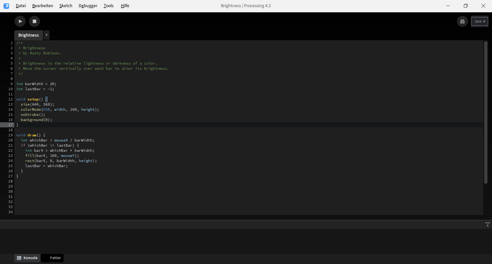

Better Processing Dark Theme
===================

## Installation
### Option 1:
Save the `theme.txt` in your processing folder under `./lib/theme.txt`  
Open the Theme Selector under Tools in Processing  
Press "Reload theme.txt to update the current theme  
To switch to another theme you have to delete / move the `theme.txt` however or use Option 2

### Option 2
Save the `theme.txt` in your processing folder under `./lib/theme.txt/alloys/`  
You may rename the `theme.txt`  
Add the name of the renamed `theme.txt` in the `./order.txt` (has to be under the first 16 themes in the order)  
You can now freely select between the themes including this one in the Theme Selector under Tools in Processing